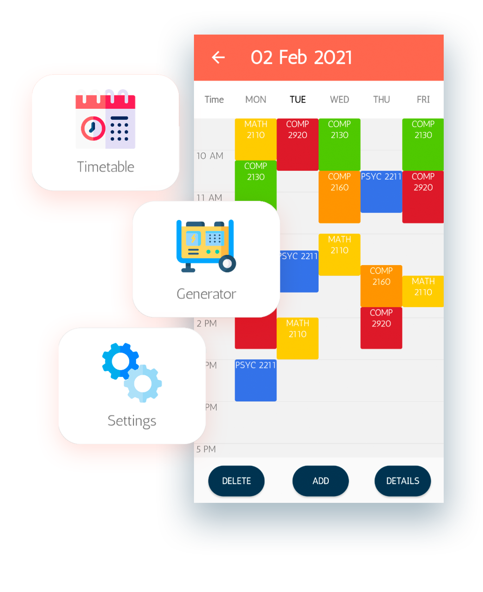
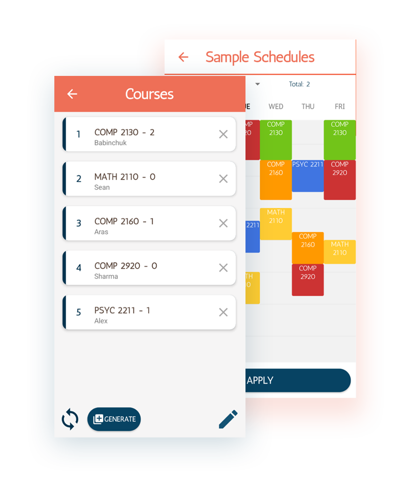

# Timely
## Mobile 1 project
Contributors:  
**Minh Anh Nguyen**  
**Vu Quang Nguyen**  
**Xuan Cuong Phan**  

Visit the app website: https://timelymobile.herokuapp.com/

This project creates a time management app for students, called Timely.

# Installation
### Option 1 (Google Play)
Get the app from Google Play by searching "Timely- CS Zone".  

### Option 2 (Manual Installation)
Download the timely_v1.apk file in the app/release folder to your phone.
Then, open the file to install the app (remember to allow install permission)

# How to Use
## Generate a new schedule
1. On Dahsboard, tap on Generator card
2. Tap on the pencil icon to add course and study time
3. Tap on Generate button
4. Input the number of courses per schedule (less than or equal the number of created courses) 
5. Choose a desired timetable from all possible conflict-free ones.
6. Hit "Apply" to save the schedule as an official one.
7. Access the generated timetable via the Timetable card on Dashboard

## Customize Study Tine and Take Note
1. On Timetable section, tap on any courses.
2. Hit "Details" button
3. Adjust the values as desired.
4. Write note in the note field.
5. Hit Save Icon to save the result.

